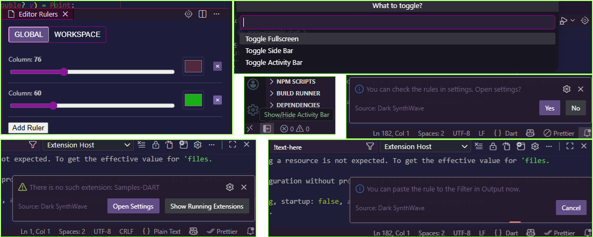

# Dark Synthwave - VSC theme

Theme based on [Synthwave Robb Owen theme](https://github.com/robb0wen/synthwave-vscode)

# Description

Ideologically close Robb's synthwave vibe - theme but *without* glowing effect - just a simple theme for comfortable coding with several extra features.
You can find native syntax highlighting for top-most known languages such as
Java, Python, Dart, C#, Kotlin, Swift, TypeScript, C++, Go and other.

And also here are extra features like *Reveal File* in the Explorer view or *Extension* (if it's opened as project and installed) and Toggle *Show/Hide Activity Bar* button in the Status Bar.

### Features
- 👁️‍🗨️ *Hidden* Extensions View. Drag it to *Extensions View Container*, then you can see all hidden extension just by expanding this view. You need to collapse this view in order not to show them again.
- 🎯 *Reveal file* is a 'target' icon on the Tab Bar. Click on it shows you: a) the file revealed in the *Explorer View* - if it's opened in the Editor right now, b) installed extension - if its name equals the project name is opened now, c) pop up message where you can choose between opening Dark SynthWave settings or all running extensions View.
- ⬅️ *Show/Hide Activity Bar* is the item in the Status Bar. Single click will hide or show - if it's hidden - Activity Bar. Rapid multiclick will show you a menu with several variants what to toggle (show/hide).
- 📟 *Rules* for the *Filter* in the *Output* channels. In the settings you can specify the string you will automatically have in the clipboard when you a) copy *non selected* text - in the selected channel specified by you or b) use 'Show Ouput Log Using Rules' command. After that you can paste the string to Output Filter, there is the only way to force the channel to filter the messages.
- 🌐 *Open Embedded Web Browser* - command in the title context menu when *'Welcome'* page is opened. Yes, you can use built-in web browser.
- 🎛️ *Theme customization* - you can customize foreground and background colors of the theme using *Color Picker* right in the settings.

## Original theme 🎨 

Original theme according to Robb 0wen is influenced by the music and the cover artwork of modern Synthwave bands like FM-84, Timecop 1983 and The Midnight. By association, that means he's also taken heavy influence from the excellent [retro-tinged artwork of James White](https://signalnoise.com/).

## Contributing original ✨
It's for the original theme: before you make any changes, [please read the contribution guide](https://github.com/robb0wen/synthwave-vscode/blob/master/CONTRIBUTING.md).

## Thanks from Robb 🫡
>Lastly, I couldn't have made this if it weren't for the fantastic work of [Sarah Drasner](https://twitter.com/sarah_edo). Her [tutorial on theming for CSS tricks](https://css-tricks.com/creating-a-vs-code-theme/) was a huge help in developing this 🙏
>Similarly, I'd like to thanks [Wes Bos](https://twitter.com/wesbos) for his [cool Cobalt2 theme](https://github.com/wesbos/cobalt2-vscode). His readme helped me figure out how to package this hot mess for public use 👍
>If this theme is too much, then I recommend [Horizon](https://github.com/jolaleye/horizon-theme-vscode), or [City Lights](http://citylights.xyz/) for a similar, yet more understated, retro vibe. They're both beautiful.

## Thanks from Me 🫡
>Thank you [Robb](https://github.com/robb0wen)

## Changelog 📜

### 1.0.5

 - [Theme customization](https://github.com/maxoiduss/dark-synthwave-84/commit/7c40a92cfef325800b567fb36e939715ec0224e7) in settings using [`Color Picker`](https://github.com/maxoiduss/dark-synthwave-84/commit/f7d759a7d892f6745a588022153d3d4bca6d9a1c).

 - [`Reopen Closed Editor` and `Open Embedded Web Browser` commands](https://github.com/maxoiduss/dark-synthwave-84/commit/0b842c88b779d9f8f9ee561762553793c084727d) in the title context menu.

#
### 1.0.4

 - [Hidden *Pick dialog* menu](https://github.com/maxoiduss/dark-synthwave-84/commit/4172c13bb11bafb00e7eecde3165f02187563d81) - on multiclicking on <a href="#102">`Show/Hide Activity Bar`</a> button *(the menu may be populated later)*

 - [Noticable theme colors](https://github.com/maxoiduss/dark-synthwave-84/commit/900b83ab0bcf09a01cdbdf2e17e9d69ae0958298) - to detect active and inactive windows

#
### 1.0.3

 - [New `Reveal File or Extension` feature](https://github.com/maxoiduss/dark-synthwave-84/commit/7cfd19d350a66fb15d8a0953981d758e798f7ff0) - can show *extension's settings* otherwise

 - [ `Output Filter Handling` command](https://github.com/maxoiduss/dark-synthwave-84/commit/494e3367996a0164fe0871486cce031d211716df) and [*rules* in the settings](https://github.com/maxoiduss/dark-synthwave-84/commit/b0c891fe19963db63586fce05cc44c4eba6f9538)

#
### 1.0.2

 - [New](https://github.com/maxoiduss/dark-synthwave-84/commit/33b61d4bbcf2485f0d20f4a1de8822dcd9267602) and [*Fixed*](https://github.com/maxoiduss/dark-synthwave-84/commit/7542c6a5b5a0f1f0e606b67e84228ad7e5eb0e6a) [`Hidden Extensions`](https://github.com/maxoiduss/dark-synthwave-84/commit/7542c6a5b5a0f1f0e606b67e84228ad7e5eb0e6a) section

 - [`Show/Hide Activity Bar` button](https://github.com/maxoiduss/dark-synthwave-84/commit/7c14596d53bd3a51a7c6828ee21df6df9c38209b) - in top left of Status Bar

#
### 1.0.1
 
 - [Customized](https://github.com/maxoiduss/dark-synthwave-84/commit/143219649871903fe7672c73f5a67b7465ae8498) theme, [languages syntax](https://github.com/maxoiduss/dark-synthwave-84/commit/46f04fa7f32793020eb266b2ad30f8b4f9cbff8c) setup

 - [Initial release](https://github.com/maxoiduss/dark-synthwave-84/commit/66e1cbb29130f5cc100b3d4c7b0bc5e2a10a1921) of  [*`Dark Synthwave`*](https://github.com/maxoiduss/dark-synthwave-84) - from [*Orignal* theme](https://github.com/robb0wen/synthwave-vscode)

 
